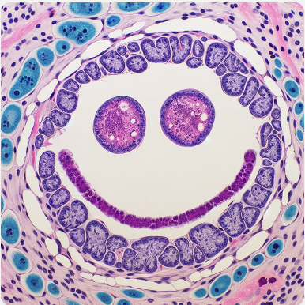
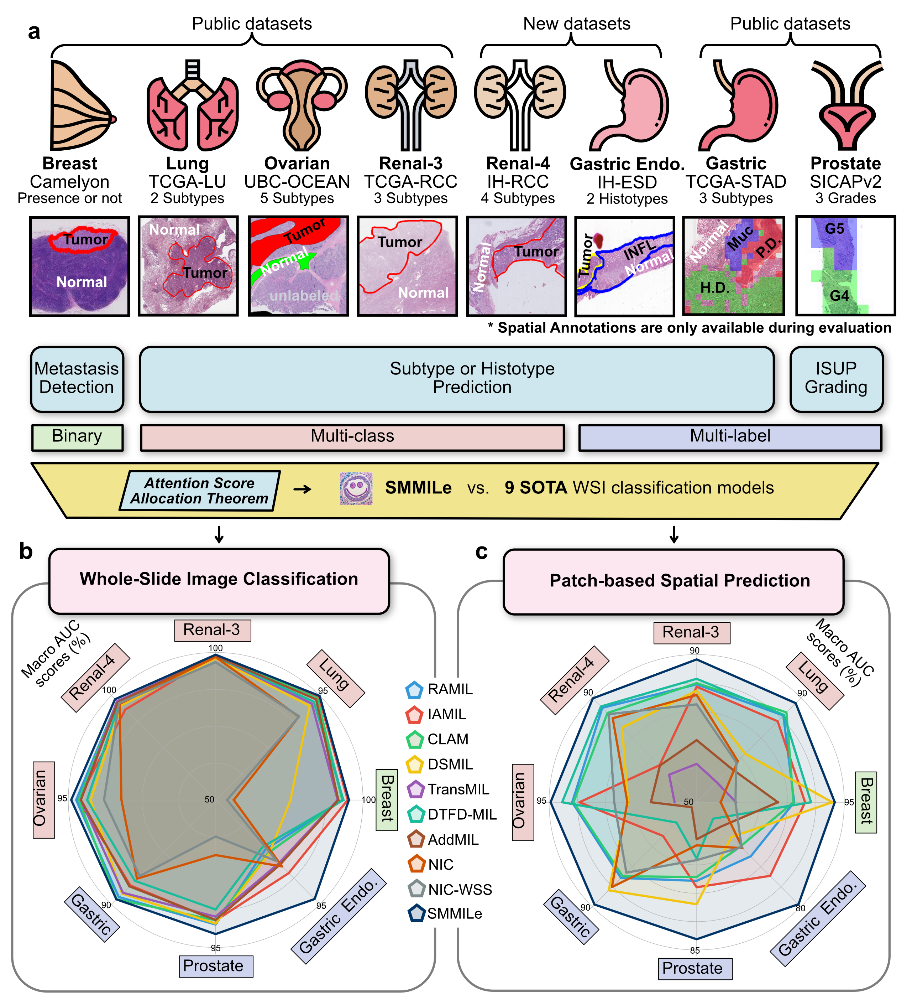
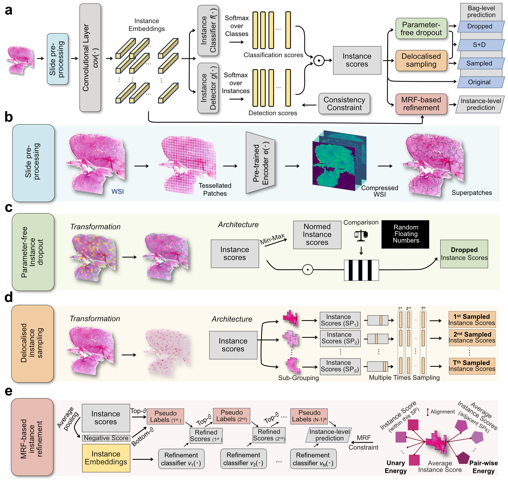

SMMILe 
===========
## Accurate spatial quantification in computational pathology with multiple instance learning.



# Installation

For HPC NVIDIA A100:
```
module purge
module load GCCcore/11.3.0 Python/3.10.4
module load GCCcore/11.3.0 OpenSlide/3.4.1-largefiles
module load CUDA/11.3.1
module load cuDNN/8.2.1.32-CUDA-11.3.1
python -m venv ./pyvenv/smmile
source ./pyvenv/smmile/bin/activate
pip install --upgrade pip
pip install -r requirements.txt
```

## Demo Datasets and Models

The original WSI files (.svs) of TCGA data can be downloaded from [GDC Portal page](https://portal.gdc.cancer.gov/v1/repository).

We provide extracted embeddings (ResNet-50, Conch) and superpixel segmentation results on our [Hugging Face dataset page](https://huggingface.co/datasets/zeyugao/SMMILe_Datasets).


# Usage
## Preprocessing
1. Embedding Extraction (Customized)
```
python feature_extraction.py --set_your_params_here
```
You can also use the standard preprocessing pipeline provided by [CLAM](https://github.com/mahmoodlab/CLAM).

2. Superpixel Generation
```
python superpixel_generation.py --set_your_params_here
```

## Training

Binary or Multi-class dataset: ``` cd single/ ```
Multi-label dataset: ``` cd multi/ ```

1. Setup the config of stage 1, for example, ```./single/configs_rcc/config_renal_smmile_r1_conch.yaml```, the current config is set for the base version without any module. 
```
python main.py --config ./configs_rcc/config_renal_smmile_r1_conch.yaml \
               --drop_with_score --D 1 --superpixel --exp_code smmile_d1sp \
               --max_epochs 40
```
2. After stage 1, setup the config of stage 2, for example, ```./single/configs_rcc/config_renal_smmile_r1_conch.yaml```
```
python main.py --config ./configs_rcc/config_renal_smmile_r1_conch.yaml  --drop_with_score --D 1 \
               --superpixel --inst_refinement --mrf --exp_code smmile_d1sp_ref_mrf \
               --models_dir /home/z/zeyugao/SMMILe/single/results_conch_rcc/smmile_d1sp_s1 \
               --max_epochs 20
```
Note that using ```--consistency``` for the dataset containing normal cases in both stages.

## Evaluation
The whole test set:
```
python eval.py --data_root_dir /path/to/extracted/embedding/folder/ \
               --data_sp_dir /path/to/superpixels/folder/ \
               --results_dir /path/to/trained/models/folder/ \
               --models_exp_code smmile_d1sp_ref_mrf_s1 --save_exp_code _conch_rcc
```
The single WSI demo (several paths need to be set in demo.py):
```
python demo.py
```

# License

This project is licensed under the GPLv3 License and is available for non-commercial academic purposes.

# Acknowledgements

# Citation

If you find any useful, please cite our paper.

Gao Z, Mao A, Dong Y, et al. Accurate spatial quantification in computational pathology with multiple instance learning[J]. medRxiv, 2024: 2024.04. 25.24306364.s

```
@article {Gao2024,
  title={Accurate spatial quantification in computational pathology with multiple instance learning},
  author={Gao, Zeyu and Mao, Anyu and Dong, Yuxing and Wu, Jialun and Liu, Jiashuai and Wang, Chunbao and He, Kai and Gong, Tieliang and Li, Chen and Crispin-Ortuzar, Mireia},
	year = {2024},
	doi = {10.1101/2024.04.25.24306364},
	publisher = {Cold Spring Harbor Laboratory Press},
	URL = {https://www.medrxiv.org/content/early/2024/04/26/2024.04.25.24306364},
	journal = {medRxiv}
}
```
